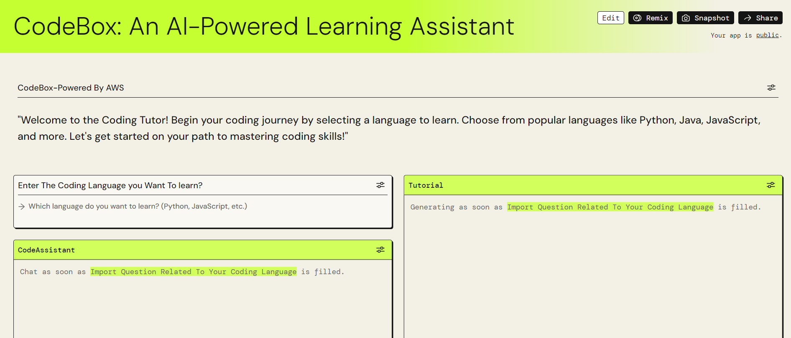

CodeBox: An AI-Powered Learning Assistant
CodeBox is an innovative learning platform designed to empower students in mastering programming languages with ease. Leveraging the power of GenAI, CodeBox provides interactive tutorials, code examples, project ideas, and comprehensive learning resources to enhance the coding journey for learners of all levels.

Features
Interactive Tutorials: Engage with interactive tutorials tailored to your learning needs and preferences.
Code Examples: Access a library of code examples and snippets to aid comprehension and learning.
Project Ideas: Explore project ideas and coding challenges to apply your skills in real-world scenarios.
Personalized Learning: Receive personalized feedback and guidance powered by GenAI's natural language processing capabilities.
Seamless Integration: Integrate seamlessly into your learning routine with a user-friendly interface and intuitive navigation.
------------------------------------------------------------------------------------------------------------------------------

Use through this link:https://partyrock.aws/u/Itsavi01/MWW6yjgIT/CodeBox%3A-An-AI-Powered-Learning-Assistant

Technologies Used
GenAI: Powering personalized learning experiences and real-time feedback.
HTML, CSS, JavaScript: Frontend development for the user interface.

Contributing
Contributions are welcome! Please follow the guidelines outlined in CONTRIBUTING.md to contribute to the project.
